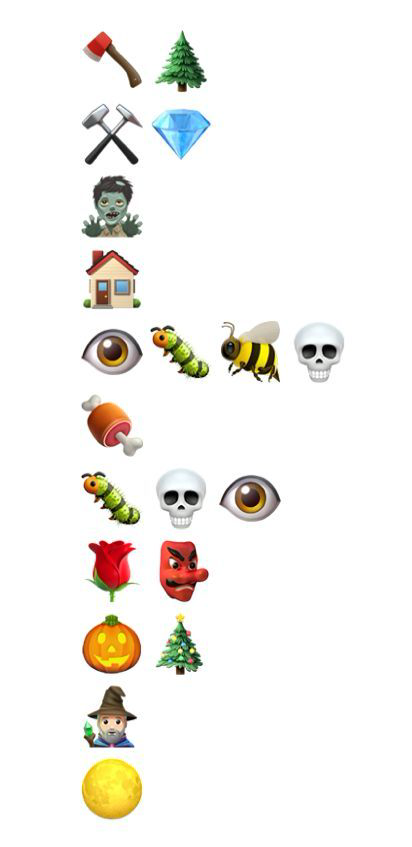

# Reverse - Week5

## MY_ARM

| 出题人 | 难度 | 附件 |
|-----|-----|-----|
| tgrddf55 | 签到 | [MY_ARM.zip](https://github.com/project-newstar/newstar-ctf-2024/releases/download/attachment-week5/MY_ARM.zip) |

> 

<strong>FLAG:</strong> <i>点此展开/收起</i>

> <code>flag{ARM__@rch1t3ctuRe_-n3eds_-t0__be_-deBugged__us1ng-_QEMU__!}</code>
> 

这是什么架构啊？

## Lock

| 出题人 | 难度 | 附件 |
|-----|-----|-----|
| 0xA1pha | 简单 | [lock.zip](https://github.com/project-newstar/newstar-ctf-2024/releases/download/attachment-week5/lock.zip) |

> 

<strong>FLAG:</strong> <i>点此展开/收起</i>

> <code>flag{d6cf50e2736849b4ba21}</code>
> 

0xA 锁住了一个秘密，快来解密吧！

PS: 本题如果运行不了，大概率是缺库。

## jun...junkcode?

| 出题人 | 难度 | 附件 |
|-----|-----|-----|
| a | 中等 | [jun-junkcode.zip](https://github.com/project-newstar/newstar-ctf-2024/releases/download/attachment-week5/jun-junkcode.zip) |

> 

<strong>FLAG:</strong> <i>点此展开/收起</i>

> <code>flag{G00d_jOb_!_7h1s_i5_nOt_0nIy_junkc0d3}</code>
> 

花指令？不确定，再看看

## Ohn_flutter!!!

| 出题人 | 难度 | 附件 |
|-----|-----|-----|
| PangBai | 困难 | [ohn_flutter.zip](https://github.com/project-newstar/newstar-ctf-2024/releases/download/attachment-week5/ohn_flutter.zip) |

> 

<strong>FLAG:</strong> <i>点此展开/收起</i>

> <code>flag{U_@r4_F1u774r_r4_m@ster}</code>
> 

听说 flutter 很难逆向呢，你可以来试试吗

## PangBai 泰拉记（2）

| 出题人 | 难度 | 附件 |
|-----|-----|-----|
| straw | 困难 | [pangbai-terra2.zip](https://github.com/project-newstar/newstar-ctf-2024/releases/download/attachment-week5/pangbai-terra2.zip) |

> 

<strong>FLAG:</strong> <i>点此展开/收起</i>

> <code>flag{W0w_y0u_$01v3_VM!!}</code>
> 

PangBai 在游玩泰拉瑞亚一个星期后，成功打过了最终 Boss 月球领主，月球领主给他发送了一串神秘代码：

好像是流程图？

## PangBai 泰拉记（3）

| 出题人 | 难度 | 附件 |
|-----|-----|-----|
| straw | 困难 | [pangbai-terra3.zip](https://github.com/project-newstar/newstar-ctf-2024/releases/download/attachment-week5/pangbai-terra3.zip) |

> 

<strong>FLAG:</strong> <i>点此展开/收起</i>

> <code>flag{Sw1ft_$0_funny!}</code>
> 

PangBai 拥有了他的第一部手机，是台二手的 iPhone7，他想用这台手机来玩泰拉瑞亚，打开 App Store 一看还需要购买，于是他找到了 straw 学长。straw 学长答应他可以给他装一个盗版的，但是要解出这一道有关 Wwift 的题目，于是他收到了一个 ipa...（有越狱果子机或者 Xcode 的同学可以尝试安装）
