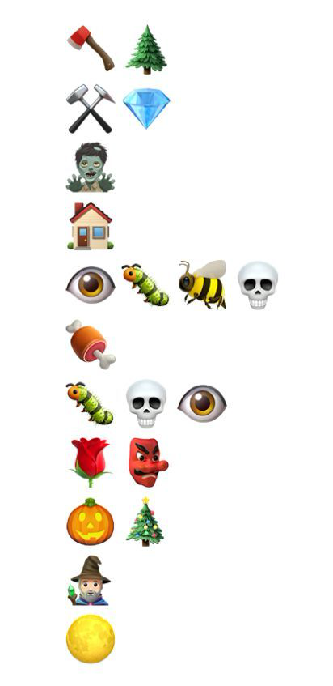

# Week5 - Reverse

## PangBai 泰拉记（2）

> 出题人：straw
>
> 难度：困难

PangBai 在游玩泰拉瑞亚一个星期后，成功打过了最终 Boss 月球领主，月球领主给他发送了一串神秘代码：

好像是流程图？

## Lock

> 出题人：0xA1pha
>
> 难度：简单

0xA 锁住了一个秘密，快来解密吧！

PS: 本题如果运行不了，大概率是缺库。

## PangBai 泰拉记（3）

> 出题人：straw
>
> 难度：困难

PangBai 拥有了他的第一部手机，是台二手的 iPhone7，他想用这台手机来玩泰拉瑞亚，打开 App Store 一看还需要购买，于是他找到了 straw 学长。straw 学长答应他可以给他装一个盗版的，但是要解出这一道有关 Wwift 的题目，于是他收到了一个 ipa...（有越狱果子机或者 Xcode 的同学可以尝试安装）

## jun...junkcode?

> 出题人：a
>
> 难度：中等

花指令？不确定，再看看

## Ohn_flutter!!!

> 出题人：PangBai
>
> 难度：困难

听说 flutter 很难逆向呢，你可以来试试吗

## MY_ARM

> 出题人：tgrddf55
>
> 难度：签到

这是什么架构啊？
